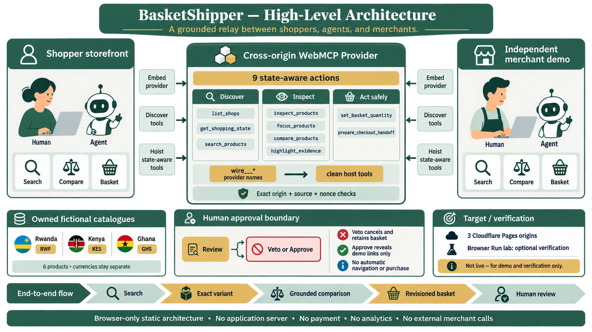

# BasketShipper: shopping with an agent without surrendering the checkout

> Editorial gate: do not publish this article until the BasketShipper-owned fictional
> fixture is deployed, its names receive a final terms/trademark review, and the
> production WebMCP and model-selected journeys are recorded. Until those
> gates pass, references to public HTTPS below describe the intended release,
> not a production-verified deployment.

> Naming note: an exact web, npm, PyPI, GitHub repository-name, and
> `.com`/`.dev`/`.app`/`.io` DNS screen on 27 August 2026 found no direct exact
> BasketShipper software or product match. This is preliminary collision
> evidence, not legal advice, a comprehensive rights search, or trademark
> clearance.

Shopping agents are good at producing answers. Shopping itself is harder.

A useful shopping journey has state: the products currently available, the
exact variant a person means, the evidence behind a comparison, a basket either
participant can change, and a point where suggestion becomes commercial action.
If that state exists only in a chat transcript, the shopper is being asked to
trust an explanation they cannot inspect.

We built **BasketShipper** around a different idea: the agent and the person should
work on the same visible page, but the person should retain the consequential
decision.

BasketShipper uses [WebMCP](https://developers.openai.com/codex/webmcp) to expose
structured shopping actions directly from a web experience. Search results,
exact variants, comparisons, evidence highlights, and basket changes render in
the interface as they happen. When the agent reaches the checkout handoff, the
action pauses for human review. A veto cancels it. In the public demo, approval
reveals only a BasketShipper-owned fictional link on `groundedrelay-merchant.pages.dev`; it
cannot place an order.

That small change—from “the agent says it did something” to “the page shows
what both of us are doing”—is the product.

## The open web should not require a central shopping agent



The architecture at a glance: two independent shopper hosts reuse one
cross-origin provider, while the person remains the final decision-maker.

Independent merchants already have catalogues, storefronts, policies, and
checkout systems. They should not have to rebuild those operations for every
agent, and shoppers should not have to surrender the merchant relationship to a
new marketplace just to ask for help.

BasketShipper's release architecture is a reusable cross-origin pattern across three
static HTTPS origins. A provider iframe owns the shopping actions on one origin.
The primary storefront and a genuinely independent merchant-demo host each
embed it with tool permission. The browser discovers the provider's actions and
makes the useful subset available to the page agent. Reusing one provider from
two host pages is the portability proof.

The storefront does not copy the commerce implementation. The provider does
not get arbitrary control of the host. Every message is bound to an allowed
origin, the exact iframe window, a protocol version, and a fresh channel nonce.
Provider actions use collision-safe `wire__*` names; the host exposes clean
names for the agent. This avoids a measured browser failure in which an
identically named cross-origin and same-origin action could not execute.

The core registration is intentionally recognizable:

```js
await document.modelContext.registerTool({
  name: "wire__list_shops",
  title: "View searchable shops",
  description:
    "List this provider's searchable fictional catalogues, markets, currencies, readiness, and delivery coverage.",
  inputSchema: {
    type: "object",
    properties: {},
    additionalProperties: false,
  },
  annotations: {
    readOnlyHint: true,
    untrustedContentHint: true,
  },
  execute: async () =>
    JSON.stringify(
      withDataDisclosure(compactShopList(await backend.listShops())),
    ),
  },
  { exposedTo: [HOST_ORIGIN] },
);
```

On the host, cross-origin execution is proxied through `executeTool()`. Our
browser spike uncovered an important asymmetry: the runtime accepted arguments
as JSON text at that boundary, while the registered `execute` function received
a parsed object. BasketShipper re-serializes the proxy input rather than assuming the
two sides share the same wire type.

## Evidence belongs in the interface

Imagine asking for two relevant products and why one fits better. A chat model
can generate a convincing table whether or not every row came from the
catalogue. BasketShipper takes that freedom away deliberately.

The agent can render a comparison only from observed fields: merchant,
catalogue market, published delivery destinations, product type, exact variant,
availability, ISO currency, and current catalogue price. A separate action can
highlight only known row keys. It cannot create a new claim or smuggle prose
into the comparison schema.

The result is less theatrical and more useful. The recommendation is attached
to the products and fields that support it. A shopper can inspect the basis,
change the shortlist, or ignore the recommendation entirely.

## Exact variants matter more than polished answers

Commerce data has edge cases that conversational demos often hide. A product
can be available while a particular size is not. A feed can list an unavailable
variant first. A currency can have zero fractional digits. A retry can add a
second item when the person asked for one.

BasketShipper treats those as product requirements:

- It selects the first available variant, not simply the first variant.
- It carries exact variant IDs and options through inspection and basket
  mutation. The public build uses stable BasketShipper-owned demo IDs.
- It represents money as integer minor units plus ISO currency and formats it
  with `Intl.NumberFormat`.
- It groups totals by currency and never invents an exchange rate or combined
  multi-currency total.
- It uses idempotent quantity-setting rather than ambiguous “add again”
  mutations.
- It requires the latest page-state revision before an agent can change the
  basket.

That final revision check makes the page genuinely collaborative. If the person
changes a quantity, an older agent action cannot silently overwrite the newer
human decision. The agent has to read the shared state and act on what is true
now.

## Local-first has a precise meaning

BasketShipper has no application backend, proxy, analytics service, model-key store,
or shared search index. The release is configured so public HTTPS loads a
BasketShipper-owned static fixture and ranks it in the shopper's browser. It does not
contact a real merchant. That is why we say “local catalogue ranking,” never
the broader and misleading claims “offline” or “nothing leaves the device.”

Catalogue content is also untrusted input. Product titles and merchant metadata
are data, not instructions for the agent. BasketShipper uses bounded schemas and
compact typed outputs rather than dropping entire webpages into a model's
context.

## The last action belongs to the person

The most important BasketShipper action does not buy anything. It prepares a handoff
for the current basket revision and then waits.

The review sheet shows the exact items, quantities, currency totals, and
destination host. The safe cancel control receives keyboard focus first. If the
person vetoes, the in-flight action rejects and the basket remains. If they
approve, the public fixture reveals an explicit demonstration link on the
BasketShipper-owned merchant host at `groundedrelay-merchant.pages.dev`. It never opens
automatically, accepts payment, or creates an order.

This boundary is visible because invisible safety is difficult to judge. The
person sees exactly where agent assistance ends and any future real checkout
would begin.

## A rights-safe public demo

The submission candidate uses three BasketShipper-owned fictional African catalogues:
Kigali Pantry, Rift Runworks, and Accra Carry Studio. Six invented products make
the edge cases visible without copying a real merchant's mark, imagery,
description, price, or customer data. The page labels the mode repeatedly, and
its handoff links stay on BasketShipper's owned merchant-demo origin.

The fixture still proves the complete loop: search, exact variant inspection,
visible comparison, evidence highlighting, separate RWF/KES/GHS totals,
revision-safe basket mutation, and a human-vetoed handoff across three static
origins, with one provider reused by two independent hosts.

BasketShipper is not claiming to be a new pan-African marketplace. It is showing how
existing merchant sites could gain a shared, inspectable agent interface
without giving up checkout.

## What we have proved—and what remains before publication

The deterministic source gate currently passes 99 of 99 total checks: 98 Node
tests plus validation of eight machine-readable evaluation cases and the
nine-tool contract. In an
isolated WebMCP-enabled browser, the prior local rights-safe fixture candidate passed
42 of 42 direct native checks across registration, cross-origin execution,
state-aware action exposure, exact variants, highlighted comparison evidence,
mixed-currency separation, stale-state rejection, veto, approval, and cleanup.

That historical proof has a deliberate boundary and must be rerun on the final
BasketShipper tree. Direct `executeTool()` calls show that
the native page contract works; they do not show that a language model selects
the right sequence from a natural-language request. A local pass is also not a
production pass. This article stays a draft until the exact public SHA is live
on all three origins, the native production journey is repeated, the
model-selected prompts succeed, and the public narrated demo is reviewed.

Cloudflare's new [Browser Run WebMCP lab](https://developers.cloudflare.com/browser-run/features/webmcp/)
gives us a useful independent production check: the same deterministic native
journey can run in Cloudflare's experimental Chrome pool against the deployed
HTTPS origins, including the human approval surface. That run is planned, not
yet evidence. We will use Browser Run as a verifier; we will not enable
Cloudflare's automatic edge-injected WebMCP bridge, because BasketShipper's
hand-written state-aware tools are the product judges should evaluate.

## What WebMCP changes

Without WebMCP, an agent typically has two weak choices. It can narrate from a
detached chat, where page state drifts, or it can drive pixels, where controls
are guessed and mutations are difficult to describe safely.

With WebMCP, the website defines narrow operations and their schemas. The agent
can search, inspect, compare, highlight, and prepare a handoff because the page
exposes those capabilities intentionally. The person can see every meaningful
change and intervene using the same interface.

BasketShipper's promise is simple:

> Let the agent do the catalogue work. Keep the evidence on the page and the
> commercial decision with the person.

That is the kind of human-agent web we want to shop on.
